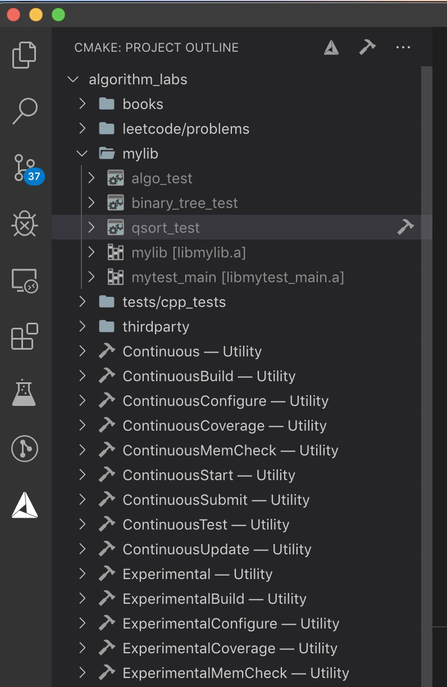

# algorithm-labs

Most used: go and c++

## Prerequisites

```bash
git submodule update --init
sudo apt install valgrind
```

## Tips

### C++ MemCheck

```bash
mkdir build && cd build
cmake ..
make -j16
ctest -D ExperimentalMemCheck
```

### Go Tests Coverage

```bash
go test -cover
# or
go tool cover -html=cover.out
```

## Editor

VS Code with CMAKE



## LICENSE

<https://github.com/shinexia/algorithm-labs/blob/master/LICENSE>
